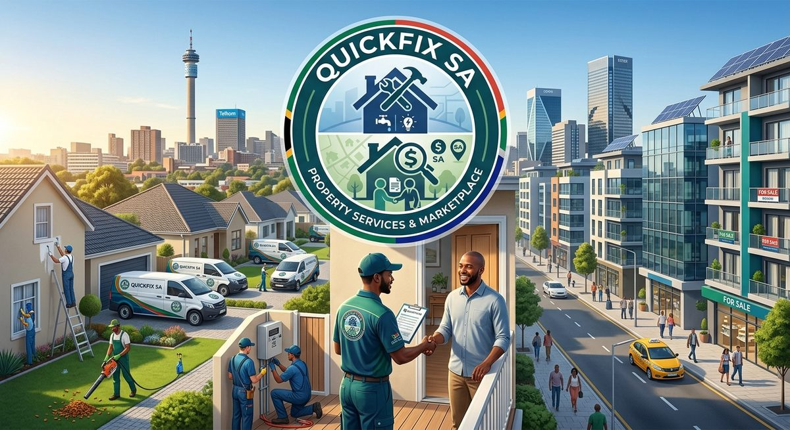

[](https://classroom.github.com/a/PhWn_eB9)
[](https://classroom.github.com/online_ide?assignment_repo_id=24306920&assignment_repo_type=AssignmentRepo)

## QuickFix SA Website

## WEDE5020Website Development Project

### Student Information

**Student Name:** Mmola Phineas Matlou  
**Subject:** WEDE5020  
**Year:** 2026  

---

##Project Overview

QuickFix SA is a fictional South African property services and property discovery website.

The website is designed to help users find properties and access reliable property maintenance services. Users can browse properties for sale, find repair professionals and make enquiries about services or properties.

The main purpose of the website is to make property-related services easier and more convenient for users.

---

##Website Objectives

The website aims to:
- Allow users to find properties.
- Allow users to view property information.
- Allow users to find repair professionals.
- Provide different repair service categories.
- Allow users to make service enquiries.
- Allow users to make property enquiries.
- Provide contact information for QuickFix SA.
- Provide a simple and easy-to-use website.
- Make the website suitable for desktop and mobile users.

---
##Website Pages

The website contains the following pages:

### Home

The homepage introduces QuickFix SA and provides links to the main property and repair service sections.

### About Us

The About Us page provides information about QuickFix SA, including its history, mission, vision and target audience.

### Services

The Services page provides information about different property maintenance services, including:

- Plumbing
- Electrical services
- Appliance repairs
- Carpentry
- Locksmith services

### Properties

The Properties page displays example properties available for sale.

Users can view information such as:

- Property location
- Price
- Number of bedrooms
- Number of bathrooms
- Property description

### Enquiry

The Enquiry page contains a form that allows users to submit a property or repair service enquiry.

### Contact

The Contact page provides QuickFix SA contact information and office locations.

---

##Technologies Used

The website is developed using:

### HTML5

HTML5 is used to create the structure and content of the website.

### CSS3

CSS3 is used to style the website, including the layout, colours, spacing, navigation and overall appearance.

### JavaScript

JavaScript is included in the project for future interactive functionality such as form validation, search, filtering and other website interactions.

---

## Project Structure

```
quickfix-sa/
├── index.html          Home page
├── about.html          About Us
├── services.html       Repair services
├── properties.html     Properties for sale
├── enquiry.html        Enquiry form
├── contact.html        Contact details and contact form
├── css/
│   └── style.css       External stylesheet (all pages link to this)
├── images/             Logo, hero image, property and service photos
├── js/
│   └── script.js       Mobile navigation menu toggle
└── screenshots/        Responsive testing evidence
```

---

## Part 2: CSS Styling and Responsive Design

### External Stylesheet

All six pages link to one external stylesheet, `css/style.css`, using:

```html
<link rel="stylesheet" href="css/style.css">
```

The stylesheet is organised into eight commented sections so each
requirement is easy to locate:

| Section | What it covers |
|---------|----------------|
| 1. CSS Custom Properties | Colours, spacing, fonts, shadows defined once in `:root` |
| 2. Reset & Base Styles | `box-sizing: border-box`, margin/padding reset, default body styles |
| 3. Typography | Heading and body font families, sizes, weights, line heights |
| 4. Header, Navigation & Footer | Sticky navigation, header and footer layout |
| 5. Main Layout Structure | Flexbox and CSS Grid layouts |
| 6. Components | Buttons, cards and forms |
| 7. Decoration, Colour & Pseudo-Classes | `:hover`, `:focus-visible`, `:active` states |
| 8. Responsive Design | Media queries for tablet, mobile and small mobile |

### Consistent Visual Identity

The same design system is applied to every page through CSS custom
properties, so nothing is styled page-by-page:

- **Colours:** navy `#123c4a` (header/footer), green `#167a5a` (navigation),
  gold `#f2c94c` (highlights), with a light neutral `#f2f6f7` for backgrounds.
- **Typography:** Poppins for headings, Inter for body text (Google Fonts),
  sized with a `rem`-based scale.
- **Spacing:** a shared spacing scale (`--space-xs` through `--space-xl`)
  used for all padding and margins.
- **Borders and backgrounds:** consistent card treatment — white background,
  1px border, 12px radius and a soft shadow.
- **Navigation:** identical on every page, with the current page highlighted
  using `aria-current="page"`.

### Desktop Layout

- **Flexbox** is used for the header, navigation bar, the two-column hero
  section on the home page, and the forms.
- **CSS Grid** is used for the property and service card layouts
  (`repeat(auto-fit, minmax(280px, 1fr))`) and for the three-column footer.
- **Hover, focus and active effects** are applied to navigation links,
  buttons, cards, list items and all form fields. `:focus-visible` is used
  so keyboard users get a clear gold outline.

### Responsive Design

Three breakpoints are used, working down from the desktop layout:

| Breakpoint | Screen | Main adjustments |
|------------|--------|------------------|
| `max-width: 1024px` | Tablet | Two-column split becomes single column, card grid tightens, footer drops to two columns, headings scale down |
| `max-width: 768px` | Mobile | Navigation collapses into a hamburger menu, card grid becomes one column, hero stacks and centres, footer stacks to one column |
| `max-width: 480px` | Small mobile | Root font size scales down, buttons go full width, card images shorten |

Relative units are used throughout — `rem` for typography and spacing,
`%` and `fr` for widths, and `vw` in the image `sizes` attributes.

### Responsive Images

- Every image uses `max-width: 100%` and `height: auto`, so nothing
  overflows the page.
- The hero, property and service images use `srcset` and `sizes` so smaller
  screens download smaller files. For example:

```html

```

- `loading="lazy"` is applied to below-the-fold images.
- Card images use `object-fit: cover` with a fixed height so the grid stays
  tidy even though the source photos have different aspect ratios.

---

## Responsive Testing Evidence

Tested in Google Chrome Developer Tools using the device toolbar
(Ctrl + Shift + M) at desktop, tablet and mobile sizes.

### Desktop (1440px)


### Tablet (820px — iPad Air)

The two-column content splits into a single column and the footer drops from
three columns to two.


### Mobile (390px — iPhone 12/13)

The navigation collapses into a hamburger menu, cards become a single
column, and all images resize to fit the screen.


---

## Changelog

### Part 2 — CSS Styling and Responsive Design

**Corrections made from Part 1 feedback**

- **Fixed broken image file paths.** The logo was referenced three different
  ways across pages (`images/QuickfixLogo.png.png`, `images/QuickfixLogo.png`)
  and the hero image path (`images/Hero.png.jpg`) did not match any real file,
  so images were not displaying. All image files were renamed to a consistent
  lowercase convention (`quickfix-logo.png`, `hero-1200w.jpg`,
  `property-1.jpg`, `service-plumbing.jpg`) and every reference was updated.
- **Added missing `<meta charset="UTF-8">`** to all six pages so special
  characters render correctly in every browser.
- **Added missing `<meta name="viewport" content="width=device-width,
  initial-scale=1.0">`** to all six pages. Without this tag mobile browsers
  ignore media queries entirely and render the desktop layout zoomed out,
  so responsive design could not work without it.
- **Added `lang="en"` to the `<html>` element** on every page for
  accessibility and validation.
- **Optimised oversized images.** The electrician photo was 519 KB; it was
  resized and recompressed to 63 KB with no visible quality loss, and all
  other photos were compressed to reduce page load time.
- **Corrected the misspelt image filename** `logsmith.jpg` to
  `service-locksmith.jpg`.

**New work for Part 2**

- Added a complete external stylesheet (`css/style.css`) with a CSS reset,
  custom properties, typography scale, layout system, components and
  interaction states.
- Added Google Fonts (Poppins and Inter) with a system font fallback stack.
- Built the desktop layout using Flexbox (header, navigation, hero, forms)
  and CSS Grid (card layouts, footer).
- Added `:hover`, `:focus-visible` and `:active` states to every link,
  button, card and form field.
- Added three responsive breakpoints (1024px, 768px, 480px) that adjust
  layout, typography, navigation and images.
- Restructured the property and service listings into semantic
  `<article class="card">` elements inside a `<div class="card-grid">`
  container so they lay out as a responsive grid.
- Restructured the home page hero into a two-column Flexbox layout that
  stacks on smaller screens.
- Added a collapsible hamburger navigation menu for mobile
  (`js/script.js`), with a no-JavaScript fallback that leaves the menu open.
- Added current-page highlighting in the navigation using `aria-current`.
- Rebuilt the footer as a three-column grid (brand, quick links, contact)
  that stacks to one column on mobile.
- Added `srcset`, `sizes` and `loading="lazy"` to content images, with
  400w/480w/800w/1200w variants generated for each photo.
- Added a favicon using the QuickFix SA logo.
- Removed `<br>` tags from the forms — spacing is now handled by CSS
  (`display: flex` with `gap`), which keeps the markup clean.
- Added responsive testing screenshots to this README.

---

## References

Google Fonts. 2026. *Poppins and Inter typefaces*. [Online]. Available at:
https://fonts.google.com [Accessed 17 September 2026].

Mozilla Developer Network. 2026. *CSS Grid Layout*. [Online]. Available at:
https://developer.mozilla.org/en-US/docs/Web/CSS/CSS_grid_layout
[Accessed 17 September 2026].

Mozilla Developer Network. 2026. *CSS Flexible Box Layout*. [Online].
Available at:
https://developer.mozilla.org/en-US/docs/Web/CSS/CSS_flexible_box_layout
[Accessed 17 September 2026].

Mozilla Developer Network. 2026. *Responsive images*. [Online]. Available at:
https://developer.mozilla.org/en-US/docs/Web/HTML/Guides/Responsive_images
[Accessed 17 September 2026].

Mozilla Developer Network. 2026. *Using media queries*. [Online]. Available
at: https://developer.mozilla.org/en-US/docs/Web/CSS/CSS_media_queries/Using_media_queries
[Accessed 17 September 2026].

W3Schools. 2026. *CSS Variables — The var() Function*. [Online]. Available
at: https://www.w3schools.com/css/css3_variables.asp
[Accessed 17 September 2026].
